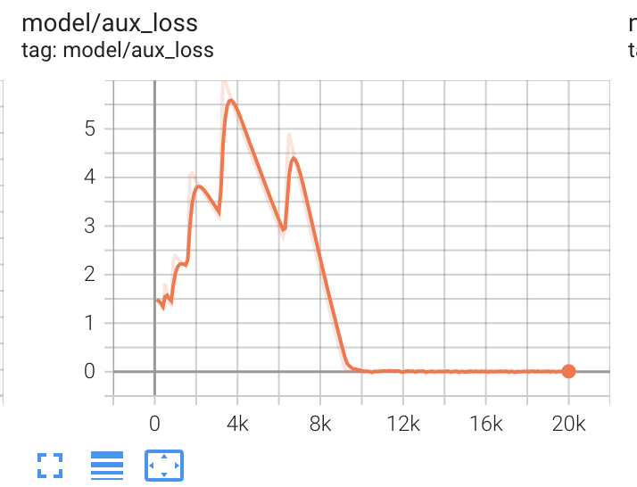

## Design Choice: HardConcreteMask or SoftTopKMask
The main reasons that we choose SoftTopK instead of the HardConcrete for mask generation are straightforward: we empirically find **(1) both two choices lead to similar performance** and **(2) SoftTopK enables more stable training.**

- First, recall the HardConcrete operator is implemented by adding a penalty loss to the LM training loss for  sparsity control:

$$\mathcal{L}_{\text{prune}}(\theta, z, \lambda, \phi) = \ell_{\text{CE}} + \lambda(z - z^{*}) + \phi(z-z^{*})^{2},$$

where $z$ is the current sparsity of the LLM, $z^{*}$ is the target sparsity of pruning. 

We find at the beginning of the pruning, since the model needs to adapt to the sparsity constraint, the first term in the above equation incurs significant loss value and make the training unstable. See the following two images:

In contrast, SoftTopK pick the top-k rows/columns of the FFN layer according to the importance score predicted by the sparsity predictor. This process does not introduce additional loss, leading to a more smoothed training:

